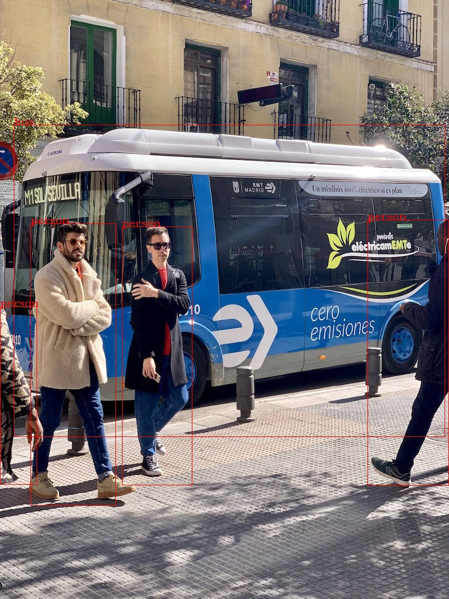

# YoloV5_onnx2trt
> onnx->tensorrt c++ 部署
> 支持图片、视频、摄像头

##  Quick Start
- 训练模型
- 导出为onnx文件
- 将onnx文件放到工程目录下的model文件夹下
- 配置相关环境，opencv,cuda …
- 更改classnames,mIou_thresh,mConf_thresh
- 编译
    ```shell
    mkdir build 
    cd build
    cmake ..
    make 
    ```
- 运行 -i 输入路径 -o 输出路径
     ```
  ./build/demo -i ./images/bus.jpg -o ./assert/bus_result.jpg
     ```
## Demo



